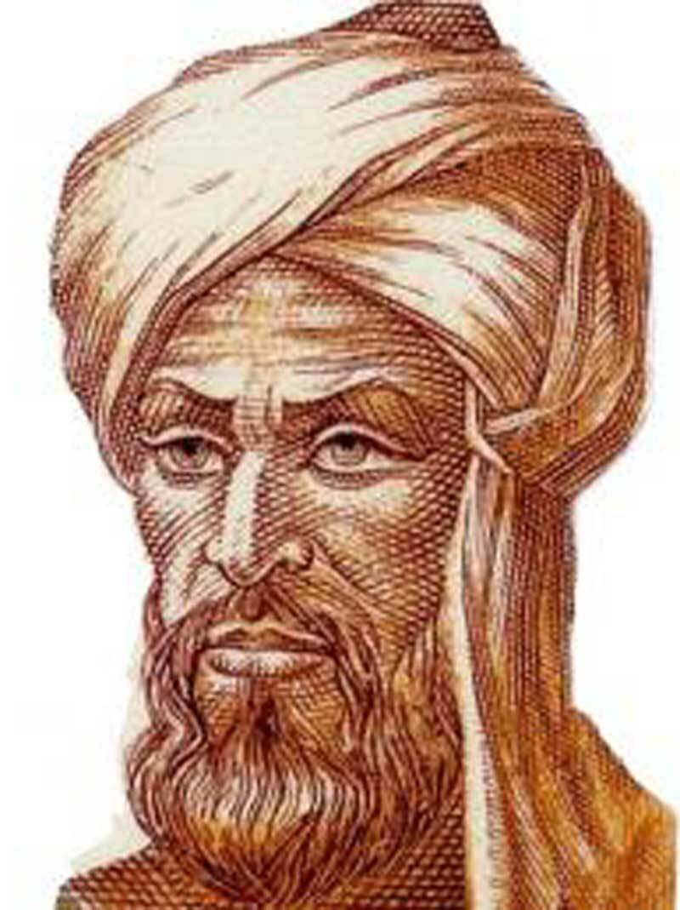

# Muhammad ibn Musa al-Khwarizmi: A Historical Record

Muhammad ibn Musa al-Khwarizmi (c. 780 – c. 850 CE) was a Persian mathematician, astronomer, and polymath whose work during the Islamic Golden Age provided the literal vocabulary and framework for modern mathematics.

Writing primarily in Arabic - the scientific lingua franca of the era - he bridged the gap between ancient Eastern wisdom and the eventual European Renaissance.

He was born in Khwarazm (modern-day Uzbekistan) and spent his professional life in Baghdad at the House of Wisdom (Bayt al-Hikma). This institution was not merely a library, but a world-class research center where scholars synthesized Greek, Persian, and Indian knowledge into a new, unified scientific tradition.

## 1. The Father of Algebra

Al-Khwarizmi’s most defining contribution was his book Al-Kitab al-Mukhtasar fi Hisab al-Jabr wal-Muqabala (The Compendious Book on Calculation by Completion and Balancing).

Before al-Khwarizmi, mathematics was often a series of specific solutions to specific problems. He transformed it into a general theory.

* Al-Jabr (Completion): The process of removing negative terms by adding them to the other side of an equation.
* Al-Muqabala (Balancing): The process of reducing positive terms of the same power on both sides.

While he did not use modern symbolic notation (like x or y), he solved quadratic equations using geometric proofs, literally completing the square by drawing areas to find the value of the unknown.

## 2. Arithmetic and the Birth of Algorithms

Al-Khwarizmi is the reason the Western world moved away from the cumbersome Roman numeral system.

* The Hindu-Arabic System: He popularized the base-10 positional decimal system, including the crucial use of zero (0) as a placeholder.
* Etymology of Algorithm: When his works were translated into Latin in the 12th century, his name was rendered as Algoritmi. Over time, this became the word algorithm, referring to the step-by-step procedures he championed for solving mathematical operations.
* Decimal Notation: His work Algoritmi de numero Indorum (Al-Khwarizmi on the Hindu Art of Reckoning) laid the groundwork for the arithmetic we use in every checkbook and computer chip today.

## 3. Geography and Astronomy

Beyond the chalkboard, al-Khwarizmi was a pioneer of the physical world:

* Mapping the World: In Kitab Surat al-Ard (The Image of the Earth), he corrected the geographical errors of the Greek scholar Ptolemy. He provided more accurate coordinates for the Mediterranean and helped organize a massive project to calculate the circumference of the Earth.
* The Stars: He compiled the Zij al-Sindhind, a set of astronomical tables that included calculations for the movements of the sun, moon, and the five planets known at the time. These tables were essential for timekeeping and navigation for centuries.

## 4. Historical Impact and Legacy

The translation of al-Khwarizmi’s work into Latin in 12th-century Spain sparked a mathematical revolution in Europe. Without his systematization of logic, the Scientific Revolution and the development of the computer might have been delayed by centuries.

### Key Distinctions

* A Founder of Algebra: He moved math from specific cases to general rules.
* A Pioneer of Logic: He introduced the concept of the algorithm—the core of all software.
* A Bridge of Cultures: He blended Indian numerals, Greek geometry, and Persian logic into a single system.

### Approximate Timeline

Year (Approx) | Event
c. 780 CE | Born in Khwarazm (Uzbekistan).
Early 800s | Appointed as a scholar at the House of Wisdom in Baghdad.
c. 820 CE | Published his foundational work on Algebra.
c. 830 CE | Published The Image of the Earth and astronomical tables.
c. 850 CE | Passed away in Baghdad.

In the modern world, every time we use a search engine, solve for x, or use a GPS, we are interacting with the legacy of al-Khwarizmi.
